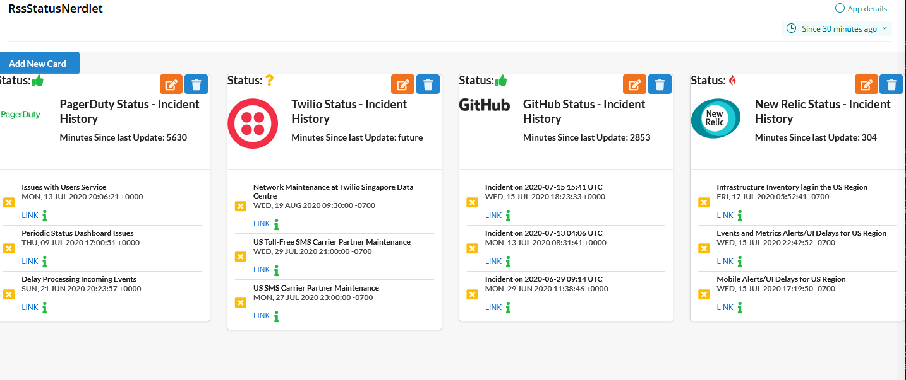

[](https://opensource.newrelic.com/oss-category/#new-relic-experimental)

# nr1-rssreader 

## About this Nerdpack

>This nerdpack is an rss reader that displays each stream on its own card.  When you add a stream, you can add a logo for the site if you wish.   The initial intention of this application was for displaying status from SAAS 
companies like AWS , AZURE.., PagerDuty, etc.   However, it is not limited to that, it can be used for any RSS source, like news or weather. 



## Open source license

This project is distributed under the [Apache 2 license](LICENSE).


## Requirements

This application requires a proxy server to fetch the rss streams through, in order to avoid CORS errors.  By defualt,  it is using a free proxy https://cors-anywhere.herokuapp.com/,
but you can use any you wish.  Currently,  the proxy is hard coded in statuscard.js file. 

## Getting started

1. Ensure that you have [Git](https://git-scm.com/book/en/v2/Getting-Started-Installing-Git) and [NPM](https://www.npmjs.com/get-npm) installed. If you're unsure whether you have one or both of them installed, run the following commands. (If you have them installed, these commands return a version number; if not, the commands aren't recognized.)
```bash
git --version
npm -v
```
2. Install the [NR1 CLI](https://one.newrelic.com/launcher/developer-center.launcher) by going to [the developer center](https://one.newrelic.com/launcher/developer-center.launcher), and following the instructions to install and set up your New Relic development environment. This should take about 5 minutes.
3. Execute the following command to clone this repository and run the code locally against your New Relic data:

```bash
nr1 nerdpack:clone -r https://github.com/newrelic-experimental/nr1-rssreader.git
cd nr1-rssreader
npm install
nr1 nerdpack:serve
```
Visit [https://one.newrelic.com/?nerdpacks=local](https://one.newrelic.com/?nerdpacks=local) to launch your app locally.

## Deploying this Nerdpack


Open a command prompt in the app's directory and run the following commands.

```bash
# If you need to create a new uuid for the account to which you're deploying this app, use the following
# nr1 nerdpack:uuid -g [--profile=your_profile_name]
# to see a list of APIkeys / profiles available in your development environment, run nr1 credentials:list
nr1 nerdpack:publish [--profile=your_profile_name]
nr1 nerdpack:deploy [-c [DEV|BETA|STABLE]] [--profile=your_profile_name]
nr1 nerdpack:subscribe [-c [DEV|BETA|STABLE]] [--profile=your_profile_name]
```

Visit [https://one.newrelic.com](https://one.newrelic.com), and launch your app in New Relic.

# Support

New Relic has open-sourced this project. This project is provided AS-IS WITHOUT WARRANTY OR DEDICATED SUPPORT. Issues and contributions should be reported to the project here on GitHub.

We encourage you to bring your experiences and questions to the [Explorers Hub](https://discuss.newrelic.com) where our community members collaborate on solutions and new ideas.

## Community

> Work with the Explorer's Hub team to create a tag for your app, then update the link below.

New Relic hosts and moderates an online forum where customers can interact with New Relic employees as well as other customers to get help and share best practices. Like all official New Relic open source projects, there's a related Community topic in the New Relic Explorers Hub. You can find this project's topic/threads here:

https://discuss.newrelic.com/t/nr1-rssreader
*(Note: This URL is subject to change before GA)*

## Issues / enhancement requests

Issues and enhancement requests can be submitted in the [Issues tab of this repository](../../issues). Please search for and review the existing open issues before submitting a new issue.

# Contributing

> Work with the Open Source Office to update the email alias below.

Contributions are encouraged! If you submit an enhancement request, we'll invite you to contribute the change yourself. Please review our [Contributors Guide](CONTRIBUTING.md).

Keep in mind that when you submit your pull request, you'll need to sign the CLA via the click-through using CLA-Assistant. If you'd like to execute our corporate CLA, or if you have any questions, please drop us an email at opensource+nr1-rssreader@newrelic.com.
